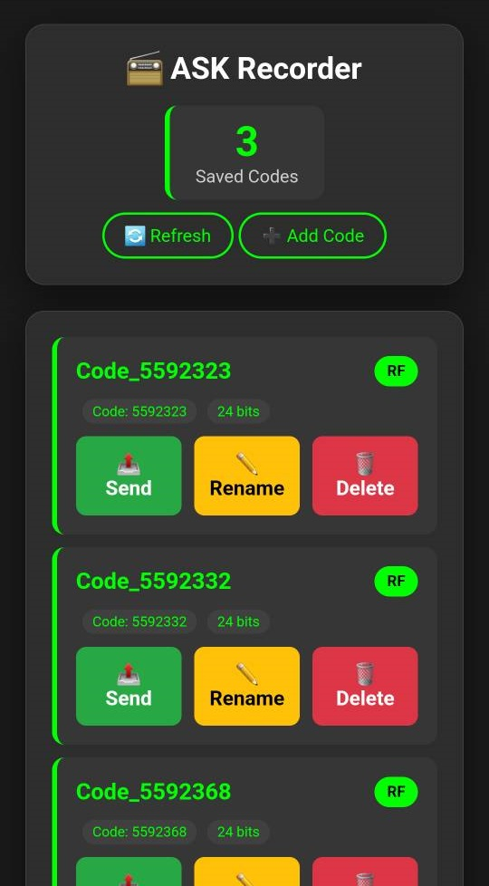

# 📡 RF Remote Middleware – Receive, Store & Copy Remote Codes

**A professional middleware for capturing, saving, and cloning wireless remote control codes (ASK/OOK)**  
Ideal for **alarm systems**, **automatic gates**, **garage doors**, and other RF remote-controlled devices.

## 📸 System Preview

  
   
  <i>Web dashboard for capturing, storing, and cloning remote codes</i>

---

## 🧠 What is this middleware?

This middleware is designed to **receive and transmit radio remote control codes** (e.g., 315 MHz or 433 MHz ASK/OOK).  
It is a powerful tool for technicians and hobbyists working with:

- 🔐 Alarm systems  
- 🚪 Automatic doors & gate openers  
- 🅿️ Barrier systems  
- 🏠 Home automation RF remotes  

It allows you to:
- 📥 **Capture & decode** remote codes  
- 💾 **Store codes permanently** (even after power loss)  
- 📤 **Clone captured codes** onto a "learn" or blank remote  
- ✍️ **Manually add codes** via a simple web interface  

> ⚠️ **Important note:**  
> The user is solely responsible for any misuse of this device. Only use on systems you own or have permission to test.

---

## ✨ Key Features

| Feature | Description |
|---------|-------------|
| 🔁 **Receive & transmit** | Works with ASK/OOK RF modules (e.g., 315/433 MHz) |
| 💾 **Permanent storage** | Saved codes remain after power cycle |
| 🧠 **Code learning** | Capture remote codes with a single button press |
| ✏️ **Manual code entry** | Add codes manually in raw or decoded format |
| 🔄 **Clone support** | Copy saved code to a learning-type remote |
| 🌐 **Web dashboard** | Easy configuration via browser |
| 📡 **Standalone AP mode** | No external Wi-Fi needed for setup |

---

## 🧰 Hardware Requirements

| Component | Recommended model |
|-----------|------------------|
| Microcontroller | ESP8266 (NodeMCU) or ESP32 |
| RF Receiver | 315/433 MHz ASK receiver (e.g., MX-RM-5V) |
| RF Transmitter | 315/433 MHz ASK transmitter (e.g., FS1000A) |
| Antenna (optional) | 17.3 cm wire for 433 MHz |
| Power supply | 5V via USB or external adapter |

> **Wiring guide** is included in the \`/docs\` folder of this repository.

---

## 🚀 Quick Start Guide

### 1️⃣ Power on the device
Plug in your ESP board. It will automatically create a **Wi-Fi access point**.

### 2️⃣ Connect to the device's Wi-Fi
- **Network name (SSID):** \`ASK\`  
- **Password:** *none – it is an open network*  

> 📱 You can connect using your phone, tablet, or laptop.

### 3️⃣ Open the web interface
In your browser, go to:

👉 **http://192.168.4.1**

You will see the main dashboard.

---

## 🕹️ How to Use

### 📥 Capture a remote code
1. From the dashboard, click **"Start Learning"**  
2. Press the button on your original remote  
3. The code will be displayed and automatically saved  

### 📤 Clone a code onto a new remote
1. Select a previously saved code  
2. Put your **learning remote** into pairing mode  
3. Click **"Send Code"** – the middleware transmits the code  

### ✍️ Manually add a code
- Enter binary or decimal code values directly  
- Assign a name/label (e.g., "Garage Door A")  

---

## 🔧 Configuration Options

| Option | Description |
|--------|-------------|
| RF frequency | Set 315 or 433 MHz (based on your module) |
| Repeat count | Number of transmission repeats |
| Bit length | Manually adjust code length (if auto-detection fails) |
| Storage management | View, edit, or delete saved codes |

---

## 🔐 Security & Responsibility

- This tool is intended **only for legal and ethical use** (your own devices or with explicit permission).  
- The author assumes **no responsibility** for illegal or unauthorized access.  
- Always test on isolated systems before real-world use.

> 🛡️ **Best practice:** Use this middleware only for educational purposes or professional servicing with consent.

---

## 📁 Repository Structure

\`\`\`
/
├── firmware/          # Arduino/PlatformIO code
├── docs/              # Wiring diagrams & manual
├── web/               # HTML/CSS/JS dashboard files
├── image1.jpg         # System preview screenshot
├── README.md          # This file
└── LICENSE            # MIT License
\`\`\`

---

## 📜 License

This project is open-source under the **MIT License**.  
You may use, modify, and share it freely, but no warranty is provided.

---

Made with ⚡ for RF enthusiasts, alarm technicians, and automation pros.  
**Use responsibly.**

